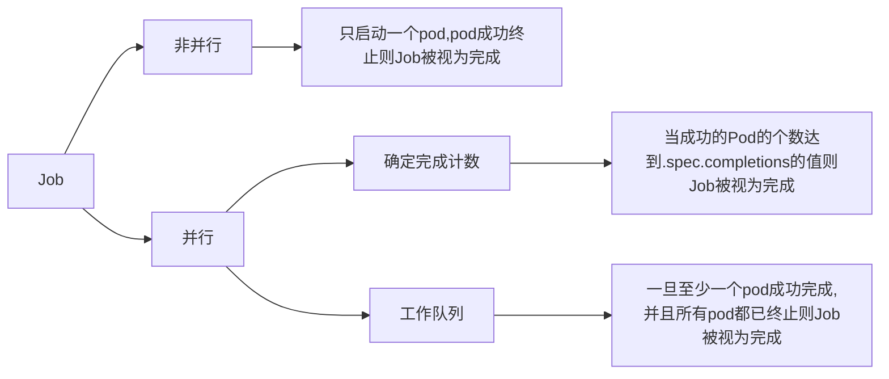

## Job
> 1. Job 会创建一个或者多个 Pod，并将继续重试 Pod 的执行，直到指定数量的 Pod 成功终止。 
> 2. 随着 Pod 成功结束，Job 跟踪记录成功完成的 Pod 个数。 当数量达到指定的成功个数阈值时，任务（即 Job）结束。 
> 3. 删除 Job 的操作会清除所创建的全部 Pod。 挂起 Job 的操作会删除 Job 的所有活跃 Pod，直到 Job 被再次恢复执行。

### Job的创建

```yaml
apiVersion: batch/v1
kind: Job
metadata:
  namespace: helloworld
  name: pi
spec:
  ttlSecondsAfterFinished: 200 # 当job完成后200s就清理这个job，如果设置为0那么在成功后立马清理，如果不设置默认不清理
  completions: 4 # 设置为0时job会被挂起
  parallelism: 2 # 默认值为1，用于表示Job执行任务的并行数。
  template:
    spec:
      containers:
        - name: pi
          image: perl:5.34
          command: ["perl",  "-Mbignum=bpi", "-wle", "print bpi(2000)"]
      restartPolicy: Never # 只能设置为Never或OnFailure
  backoffLimit: 4
```

#### Job并行执行



> 若`completion = 4`，`parallelism=2`，那么表示：按照2个pod同时启动的规则完成4个pod的成功运行即视为job已完成。

## CronJob

> 使用`cron`格式进行编写，`周期性`地在给定的调度时间创建并执行Job。

### CronJob的创建
```yaml
apiVersion: batch/v1
kind: CronJob
metadata:
  name: hello
spec:
  schedule: "* * * * *"
  jobTemplate:
    spec:
      template:
        spec:
          containers:
          - name: hello
            image: busybox:1.28
            imagePullPolicy: IfNotPresent
            command:
            - /bin/sh
            - -c
            - date; echo Hello from the Kubernetes cluster
          restartPolicy: OnFailure
```

### Cron语法

```java
# ┌───────────── 分钟 (0 - 59)
# │ ┌───────────── 小时 (0 - 23)
# │ │ ┌───────────── 月的某天 (1 - 31)
# │ │ │ ┌───────────── 月份 (1 - 12)
# │ │ │ │ ┌───────────── 周的某天 (0 - 6)（周日到周一；在某些系统上，7 也是星期日）
# │ │ │ │ │                          或者是 sun，mon，tue，web，thu，fri，sat
# │ │ │ │ │
# │ │ │ │ │
# * * * * *
```


