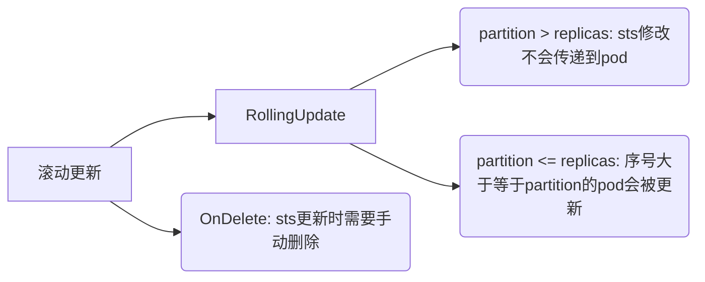

- [StatefulSet 创建](#statefulset-创建)
- [StatefuleSet创建与销毁顺序](#statefuleset创建与销毁顺序)
- [StatefuleSet参数](#statefuleset参数)
  - [updateStrategy](#updatestrategy)
  - [podManagementPolicy](#podmanagementpolicy)

---

> 1. StatefulSet 是用来管理`有状态应用`的工作负载 API 对象。管理某些pod集合的部署和扩缩，并为这些pod提供持久存储和持久标识符。
> 2. 每个Pod维护了一个有粘性的ID。这些Pod是基于相同的规约来创建的，但是不能相互替换：`无论怎么调度，每个Pod都有一个永久不变的ID`。

## StatefulSet 创建

```yaml
apiVersion: storage.k8s.io/v1
kind: StorageClass
metadata:
    name: mini-storage-class
    namespace: helloworld
parameters:
    server: 10.50.8.38
    share: /opt/share
provisioner: nfs.csi.k8s.io
reclaimPolicy: Retain
volumeBindingMode: Immediate
---
apiVersion: v1
kind: Service
metadata:
    name: nginx
    namespace: helloworld
    labels:
        app: nginx
spec:
    ports:
        -   port: 80
            name: web
    clusterIP: None # 设置无头模式，不需要负载均衡
    selector:
        app: nginx
---
apiVersion: apps/v1
kind: StatefulSet
metadata:
    name: web
    namespace: helloworld
spec:
    selector:
        matchLabels:
            app: nginx # 必须匹配 .spec.template.metadata.labels
    serviceName: "nginx"
    replicas: 1
    podManagementPolicy: OrderReady # 默认
    updateStrategy:
        type: RollingUpdate # 滚动更新，遵循销毁和创建顺序，若值为onDelete将不再自动更新pod，需要手动删除和创建
        rollingUpdate:
          partition: 1 # 序号为>=1的pod在.spec.template改动时滚动更新pod
    template:
        metadata:
            labels:
                app: nginx # 必须匹配 .spec.selector.matchLabels
        spec:
            terminationGracePeriodSeconds: 10
            containers:
                -   name: nginx
                    image: lowyard/nginx-slim
                    ports:
                        -   containerPort: 80
                            name: web
                    volumeMounts:
                        -   name: www
                            mountPath: /usr/share/nginx/html
    volumeClaimTemplates:
        -   metadata:
                name: www
            spec:
                accessModes: [ "ReadWriteOnce" ]
                storageClassName: "mini-storage-class"
                resources:
                    requests:
                        storage: 1Gi
```


## StatefuleSet创建与销毁顺序

1. N个副本的StatefuleSet，创建顺序是`0,1,2...N-1`。
2. N个副本的StatefuleSet，销毁的顺序是`N-1...2,1,0`。
3. 当第a个pod部署前，第a个pod前的所有pod必须处于running和ready状态。
4. 当第a-1个pod销毁前，第a个pod必须已经被终止和删除。


## StatefuleSet参数

### updateStrategy



### podManagementPolicy

默认是OrderReady，即上文默认的创建、销毁和扩缩顺序，如果设置为`Parallel`，会导致pod的`扩缩`过程中无需等待对应的pod进入准备或销毁状态。
