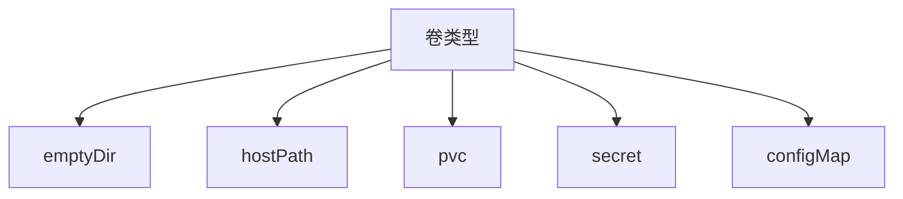

> Kubernetes卷：包含可被Pod中容器访问的数据的目录，Pod中的容器可以访问该目录中的数据。



### 卷类型

#### emptyDir

当Pod分配到某个Node上时，`emptyDir`卷会被创建，并且在Pod在该节点上运行期间，卷一直存在。Pod中的容器都可以读写`emptyDir`卷中相同的文件（容器共享）。 当Pod因为某些原因被从节点上删除时，`emptyDir`卷中的数据也会被永久删除。

```yaml
apiVersion: v1
kind: Pod
metadata:
  name: test-emptydir
  namespace: helloworld
spec:
  containers:
  - image: nginx
    name: nginx
    resources:
      limits:
        cpu: 200m
        memory: 200Mi
      requests:
        cpu: 200m
        memory: 100Mi
    volumeMounts:
    - mountPath: /cache
      name: cache-volume
  volumes:
  - name: cache-volume
    emptyDir:  {}
#    emptyDir:
#      medium: Memory # 设置emptyDir为你挂载 tmpfs（基于 RAM 的文件系统），会计入容器的内存消耗
```

> 只要Pod一直存在不被删除，那么emptyDir也会一直存在（即使容器崩溃也不受影响）

#### hostPath

`hostPath`卷能将主机节点文件系统上的文件或目录挂载到你的Pod中（因为存在安全风险，尽量避免使用hostPath）。

```yaml
apiVersion: v1
kind: Pod
metadata:
  name: test-hostpath
  namespace: helloworld
  labels:
    name: test-hostpath
spec:
  containers:
  - name: test-hostpath
    image: nginx
    resources:
      limits:
        memory: "128Mi"
        cpu: "100m"
    ports:
      - containerPort: 80
    volumeMounts:
      - mountPath: /root
        name: test-hostpath
  volumes:
    - name: test-hostpath
      hostPath:
        path: /root
        type: Directory # 必须存在root目录 type可以不填任何值，表明hostPath卷不会进行任何检查
```

- hostPath type

| 取值                | 含义                                                         |
| ------------------- | ------------------------------------------------------------ |
| `""`                | 默认值，这意味着在安装 hostPath 卷之前不会执行任何检查。     |
| `DirectoryOrCreate` | 如果在给定路径上什么都不存在，那么将创建空目录，权限设置为 0755 |
| `Directory`         | 在给定路径上必须存在的目录。                                 |
| `FileOrCreate`      | 如果在给定路径上什么都不存在，那么将创建空文件，权限设置为 0644 |
| `File`              | 在给定路径上必须存在的文件。                                 |
| `Socket`            | 在给定路径上必须存在的 UNIX 套接字。                         |
| `CharDevice`        | 在给定路径上必须存在的字符设备。                             |
| `BlockDevice`       | 在给定路径上必须存在的块设备。                               |

#### PersistentVolumeClaim

**`持久卷（PersistentVolume，PV）`** 是集群中的一块存储，可以由管理员事先制备，或者使用存储类（Storage Class）来动态制备。

**`持久卷声明（PersistentVolumeClaim，PVC）`** 表达的是用户对存储的请求。PVC可以请求特定大小和访问模式的PV。

> 1. 当用户创建一个特定容量与访问模式的PVC对象后，会被集群master节点上的控制回路监听到并找到合适的PV将他绑定到PVC上。
>
> 2. 如果是基于`storageclass`动态创建，那么在对应的PV卷创建后，控制回路也会将PV绑定到对应的PVC上。
>
> 3. 如果找不到合适的PV卷，那么PVC会无限期的处于未绑定状态，直到与之匹配的PVC卷出现。

```yaml
apiVersion: v1
kind: PersistentVolume
metadata:
  name: my-pv
  namespace: helloworld
spec:
  capacity:
    storage: 100Mi
  accessModes:
    - ReadWriteOnce # 卷可以被一个节点以读写方式挂载
  persistentVolumeReclaimPolicy: Delete
  volumeMode: Filesystem # 卷会被 Pod 挂载（Mount） 到某个目录 ，Block：将卷作为原始块设备来使用
  # hostPath:
  #   path: /root/helloworld # 绑定本地文件或目录
  claimRef: # 绑定pvc
    name: my-pvc
    namespace: helloworld
  storageClassName: mini-nfs-storageclass
  mountOptions:
    - hard
    - nfsvers=4.1
  nfs:
    path: /opt/share
    server: 10.50.8.38
---
apiVersion: v1
kind: PersistentVolumeClaim
metadata:
  name: my-pvc
spec:
  resources:
    requests:
      storage: 100Mi
  volumeMode: Filesystem
  accessModes:
    - ReadWriteOnce
  volumeName: my-pv
---
apiVersion: v1
kind: Pod
metadata:
  name: my-pod
  namespace: helloworld
spec:
  containers:
    - name: nginx
      image: nginx
      volumeMounts:
      - mountPath: "/var/www/html"
        name: nginx
      resources:
        limits:
          memory: 256Mi
          cpu: "1"
        requests:
          memory: 256Mi
          cpu: "0.2"
  volumes:
    - name: nginx
      persistentVolumeClaim:
        claimName: my-pvc # pod通过pvc来挂载存储
```

- PV访问模式

| 访问模式             | 含义                              |
| -------------------- | --------------------------------- |
| **ReadWriteOnce**    | 卷可以被一个节点以读写方式挂载。  |
| **ReadOnlyMany**     | 卷可以被多个节点以只读方式挂载。  |
| **ReadWriteMany**    | 卷可以被多个节点以读写方式挂载。  |
| **ReadWriteOncePod** | 卷可以被单个 Pod 以读写方式挂载。 |

- PV回收策略

| 回收策略         | 含义                                                      |
| ---------------- | --------------------------------------------------------- |
| **Retained**     | 当PVC对象被删除时，PV卷仍然存在，对应的数据被视为已释放。 |
| ~~**Recycled**~~ | 已被废弃。取而代之的建议方案是使用动态制备。              |
| **Deleted**      | 会将PV从集群中移除，默认回收策略。                        |

#### NFS

支持将NFS(网络文件系统)挂在到你的Pod中，nfs卷的内容在删除Pod时会被保存，卷只是被卸载。这意味着`nfs`卷可以被预先填充数据，并且这些数据可以在Pod之间共享。

> 需要先安装[nfs-client-provisioner]("../StatefuleSet/nfs_volume.yaml")，一种自动配置卷程序，它使用现有的NFS服务来支持通过持久卷声明动态配置 Kubernetes 持久卷。

```yaml
apiVersion: v1
kind: PersistentVolumeClaim
metadata:
  name: nfs-pvc # pvc的名称
  namespace: helloworld
spec:
  accessModes:
    - ReadWriteMany
  storageClassName: "mini-nfs-storageclass" # 绑定 基于nfs-provisioner创建的storageClass
  resources:
    requests:
      storage: 100Mi
```

```yaml
apiVersion: apps/v1
kind: Deployment
metadata:
  name: nfs-volume
  namespace: helloworld
spec:
  replicas: 1
  selector:
    matchLabels:
      role: nfs-volume
  template:
    metadata:
      labels:
        role: nfs-volume
    spec:
      containers:
        - name: nfs-volume
          image: nginx
          ports:
            - name: nfs
              containerPort: 80
          volumeMounts:
            - mountPath: /www/
              name: mypvc
          resources:
            limits:
              memory: 256Mi
              cpu: "0.5"
            requests:
              memory: 256Mi
              cpu: "0.2"
      volumes:
        - name: mypvc
          persistentVolumeClaim:
            claimName: nfs-pvc # 指定基于nfs创建的pvc的名称
```

#### configMap


#### secret


#### subPath

用于在单个pod中共享存储卷的多个子路径，而不是根路径。


